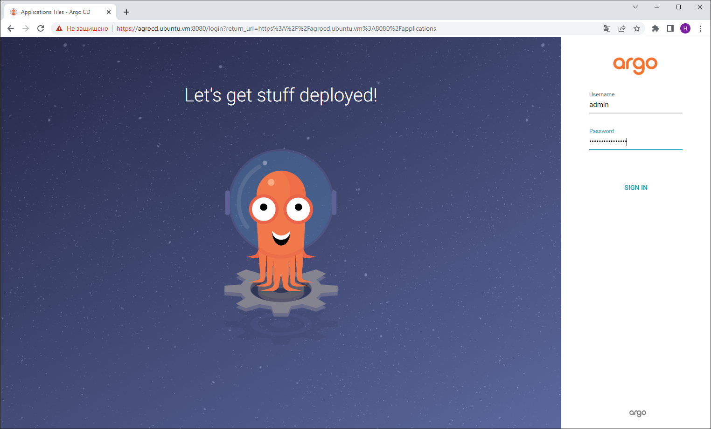
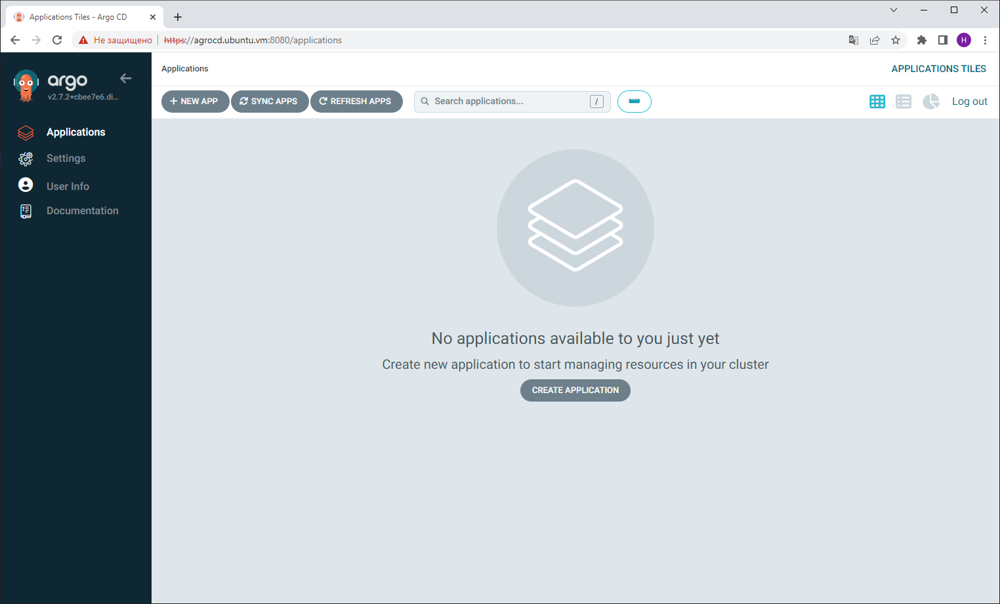

# Proof of Concept (PoC) по розгортанню GitOps системи ArgoCD на Kubernetes кластері, створеному в k3d

## Мотивація

Перевірити технічну можливість реалізації концепції продукту AsciiArtify з мінімальним набором функцій в середовищі ArgoCD.

Кластер Kubernetes розгорнемо за допомогою **k3d** - інструменту, що узгоджений на етапі Concept

## Інсталяція

1.1 Створюємо Kubernetes кластер, за допомогою наступної команди:

   ```bash
   k3d cluster create argo -s 1 -a 3
   ```

1.2 Розгортаємо AgroCD в namespace 'argocd':

   ```bash
   kubectl create namespace argocd
   kubectl apply -n argocd -f https://raw.githubusercontent.com/argoproj/argo-cd/stable/manifests/install.yaml
   ```

1.3 Після закінчення розгортання надаємо доступ до графічного інтерфейсу ArgoCD за допомогою Port Forwarding:

   ```bash
   kubectl port-forward service/argocd-server -n argocd --address 0.0.0.0 8080:443 > /dev/null&
   ```

1.4 Отримаємо тимчасовий пароль адміністратора для першого входу в систему:

   ```bash
   kubectl -n argocd get secret argocd-initial-admin-secret -o jsonpath="{.data.password}" | base64 -d; echo
   ```

## Конфігурація

2.1 Для доступу до графічного інтерфейсу необхідно в браузері набрати:

   ```text
   argocd.ubuntu.vm:8080
   ```

2.2 Для першого входу в систему скористаємося логіном `admin` та тимчасовим паролем, який ми отрмали в п1.4





[](https://asciinema.org/a/UVvFrtkIkbVQLo6tfyXcfkRwv)
